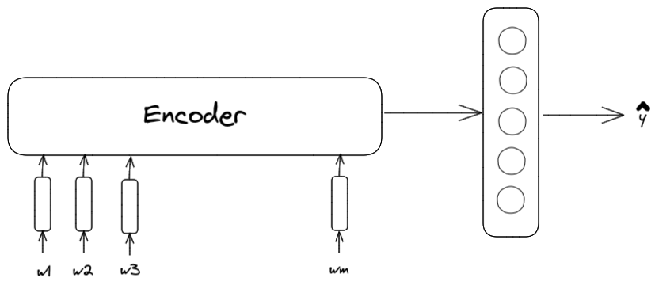
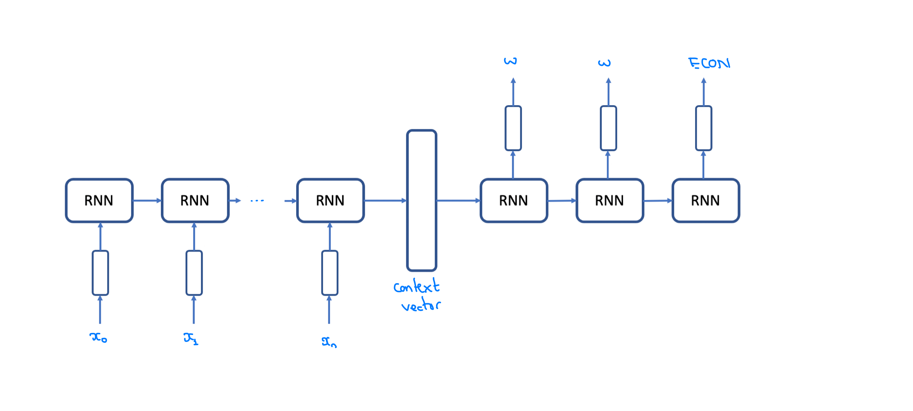

<h1 align="center">Text Endpoint Detection for Conversational Agents</h1>
<h3 align="center">CSE538 NLP: Project Intermediate Report</h3>
<h4 align="center">Team: Anh Nguyen, Omkar Manjrekar, Sriram Vithala</h4>

#### NOTE: The sections updated after "project proposal" have been labelled as [UPDATED].

## 1. Project Idea

When you are chatting with your friend, you seldom type entire body of the message and press send. Instead you will type one message after another and your friend knows to respond when you have specified the required information.

Most conversational agents ("chatbots") in use, require a user to specify all the information in one message like an email and less like a chat. If the user doesn't do that, the agent either detects the intent of the message incorrectly or detects it as "UNKNOWN" intent ("I don't know what that means").

Multiple messages provide extra information which might be needed by the receiver to reply. In contrary to email, in a setting like chat this information can be made available **through-request** **by** the **receiver** or **by realisation** **of** the **sender**. This makes text messaging less formal and more flexible (and is also the reason why people might prefer messaging over email).

The purpose of the project "Text Endpoint Detection for Conversational Agents" is to make these agents learn to reply to the user, when the user has specified required information.

## 2. Problem description

We call this the task of **Text Endpoint Detection (TED)**. Given a set of words $W = \{w_1, ... w_n\}$ the task is to **find boundaries between which the** **words combine together to form a complete utterance that the agent can answer.** Thus the completeness of utterance depends on the knowledge of the agent.

A variant of this task appears in context of speech processing where the sentence boundaries aren't explicit.

#### 2.1 The problem is interesting because:

 It requires an agent to understand following things about natural language:

1. Is the utterance complete? The sentence might have grammatical mistakes or missing punctuation.
2. Does the text make sense (yet)?
3. Does the text contain **information** **required by the agent to reply**? This may be conditioned on the agent's goal (where the goal can be pizza delivery, restaurant booking, or just chitchat, etc.)

#### 2.2 The problem is complex because:

1. The user might skip intent between sentences. The **first** message **and** **third** message provide information about one user intent and **second** message contains another intent.
2. Sometimes it might be okay to reply or wait when the user is still typing.
3. Requires taking into consideration what knowledge is required to reply.

There are atleast two approaches to any machine learning problem: Discriminative and Generative. We take a discriminative approach towards solving this problem.

## Problem Formulation

### 1. Classification

Given a set of words, determine whether to wait or reply.

$\hat{y} = argmax_y Pr(y|w_1,...w_t)$ where $y \epsilon \{wait, reply\} $

### 2. Sequence Labeling

Given a set of words, determine endpoints by labeling the endpoints as reply and other words as wait.

$\hat{y_t} = argmax_y \prod_1^t Pr(y|w_1,...w_t)$ where $y \epsilon \{word, \lt ECON\gt\} $

*where $<ECON>$ indicates **end of context**.*

The **above two formulations don't encompass skipped intents**. Formulations described in 3 and 4 can deal with this problem.

### 3. Clustering [UPDATED]

Learn contextual representation of words which includes positional information. Then either **cluster or regress the boundaries**.

#### 3.1. Clustering with Graph Cut

The clustering idea is inspired from graph cut used for segmentation in computer vision. The analogy is here we are clustering sentences. An additional classification step is required to decide whether to **wait or reply** to the utterance.

#### 3.2. Graph Neural Networks

Graph Neural Networks have been used for Key Information Extraction (KIE). KIE is used for extracting information in document images for example extracting names of items, their price, shop name, tax, etc. from a receipt. The text for these items may span multiple rows or columns. Thus graph neural networks can be used to cluster words that span different sentences and contain an intent. 

#### 4. Regression (by voting)

This is regression approach inspired from generalized hough transform and text or object detection techniques.

Each word votes for values between $0.0$ and $1.0$ which is their boundary (when multiplied by number of words). Then we consider the boundaries that contain the most votes. The words that vote for these boundaries form a unique intent. A major problem with this approach is the word boundaries could be off by a few words. 

## Approach

#### Word Embeddings

Our work depends on the meaning of user's utterances, thus using contextual embedding such as ELMo is a good start. In [Le et al], the author used a combination of GloVe, ELMo, and CNN chars embedding. In my opinion, it's a bit unnecessary and it could increase the training/inference time but we definitely consider it as a potential way to improve out baseline.

#### 1. TED as Classification Task

The task is given a set of utterances, called $S = {s_1, s_2, ..., s_n}$. Then an encoder compresses user's messages into a vector $c$ to use in the classifier layers.

The objective task is formalized as:

$\hat{y}$ = $$P(y|s_1, s_2, ..., s_n) = P(y|w_1, w_2, ..., w_m)$$

There are many encoder architectures we could try such as RNN-variant, Transformers, BERT, etc.

#### 2. TED as Sequence Labeling Task

In the first approach, we need a trigger to know when the users finished their typing (for example from the time between each utterance) or we have to feed the encoder the new data every time user finished a chat, i.e the data will be ${s_1, (s_1, s_2), (s_1, s_2, s_3),...}$. This could be a trouble if the model has high complexity and takes time to generate a context vector. We should not make users wait. Thus the second approach will take a stream data as an input and generate label sequence with the same length as input. In this approach, the labels set consists of three tokens ${W, ECON}$ which denotes words and end of context.

Because formulized as a Neural Machine Translation task, then the probability of a word $y_i$ is

$$P(y_i|x_1, x_2, ... x_k)$$		

When ever we see the ECON token, we should pass the context vector or sequence of input words to chatbot. There are several studies on the same problem, where we need to generate output sequence simultaneously with the input sequence. One of the work is from [Cho et al] where the authors proposed a new algorithm for decoder named Simultaneously Greedy Decoding. It's complicated where we need two new hyparameters to control delay and quality. For our problem, we will prioritize quality over delay a bit since it's bad to interrupt user.

#### 3. TED as multi-task learning [UPDATED]

As explained in section **2.2**, in order to determine whether to reply or not it is required to take into account the knowledge possessed by the agent. **This motivates us to use multi-task learning to learn intent detection and endpoint detection**.

## Data

Due to unavailability of data for the exact task of interest (TED), we synthesize data by using existing single or multi-domain dialogue datasets. The positive data or **reply** examples exist already and we generate **wait** examples by deleting words or complete sentences.

Following are some of the datasets that we can use:

**MultiWOZ**: Each dialogue consists of a goal, multiple user and system utterances as well as a belief state. Even though all dialogues are coherent, some of them were not finished in terms of task description. There are multiple occurences where the sentence is complete but the intent is not complete. We can use this dataset to understand/learn whether the message that user wants to convey has been done or not. This defines/helps in when the chatbot/user2 will reply or wait for the incoming message.

**DailyDialog**: The dialogues in the dataset reflect our daily communication way and cover various topics about our daily life. We also manually label the developed dataset with communication intention and emotion information.

We've customly modified MultiWOZ dataset based on the requirements of the model we are developing. We've taken two types of cases into consideration. 

Were creating the data in a way that messages contain multiple input statements and also having multiple contexts in the message said:

Example: Thanks so much. I would also need a place to say. I am looking for something with 4 stars and has free wifi. 

One is the case where there are multiple input scentences containing the context/quetionare of the message being split between multiple sentences so that the model can understand that the context can be shared between all the input data and wait until the whole requirement/context being shared by the user1. 
The Second case is that each sentences share multiple contexts or meanings in the message but the message is completed in the first itself but the second scentence is the extra data regarding the the first statement itself. We are trying to understand whether the data required for understanding the message shared by user is passed or not.

We've curated the data from MultiWOZ by removing the unncessary tokens and adding the <ECON> tag to understnad when the chat/ context message has completed.

#### Negative Data

We've created negative data to test the model designed by removing the multiple scentences. This case is to make sure that the model we designed understands the whole meaning of the message shared but not just shared in single sentence. It also helps us understand the learning capcity of the model based on which we can use it contexts where it can be used in a normal communicator like people where we won't say what we wanted in a single way.

Example:
Case 1: Thanks so much. I would also need a place to say. I am looking for something with 4

There is also one other negative data set generated by removing the context itself from the message or the message being cut in between, which will help to test the model whether it understood the main desire on why it was generated that it can understand whether the user sent the required message to reply or to still wait untill the message is being sent or to ask for the requirements needed to understand what the user trying to say.

Example:
Case 2: That sounds great, could you make a booking for

## Evaluation

- For the first approach, I think we should use Precision Recall and try to minimize the False Positives. It's bad when the chat bot interrupts user being talking.

* The second approach, the authors proposed a novel metrics.

## Experiments [UPDATED]

We've implemented our baselines on google colab using Pytorch.

### 1. Baseline 1: Classification using GRU/LSTM with Glove Embeddings

We use 300-dimensional Glove Embeddings that use Bidirectional GRU/LSTM with 2 units and an MLP for classification head that predicts $\hat{y} \in \{wait (0), reply (1)\}$

### 2. Baseline 2: Classification using GRU/LSTM with FastText Embeddings

We use 300-dimensional FastText Embeddings that use Bidirectional GRU/LSTM with 2 units and an MLP for classification head that predicts $\hat{y} \in \{wait (0), reply (1)\}$

FastText uses subword embeddings which are more robust to unseen words.

## Dataset [UPDATED]

We've modified MultiWOZ dataset based on the requirements of the model we are developing. We've taken two types of cases into consideration.

We are creating the data in a way that messages contain multiple input statements and also having multiple contexts in the message said:

Example: Thanks so much. I would also need a place to say. I am looking for something with 4 stars and has free wifi.

One is the case where there are multiple input sentences containing the context/questionnaire of the message being split between multiple sentences so that the model can understand that the context can be shared between all the input data and wait until the whole requirement/context being shared by the user1. The Second case is that each sentences share multiple contexts or meanings in the message but the message is completed in the first itself but the second scentence is the extra data regarding the the first statement itself. We are trying to understand whether the data required for understanding the message shared by user is passed or not.

We've curated the data from MultiWOZ by removing the unncessary tokens and adding the tag to understand when the chat/ context message has completed.

**Negative Data**

We've created negative data to test the model designed by removing the multiple scentences. This case is to make sure that the model we designed understands the whole meaning of the message shared but not just shared in single sentence. It also helps us understand the learning capcity of the model based on which we can use it contexts where it can be used in a normal communicator like people where we won't say what we wanted in a single way.

Example: Case 1: Thanks so much. I would also need a place to say. I am looking for something with 4

There is also one other negative data set generated by removing the context itself from the message or the message being cut in between, which will help to test the model whether it understood the main desire on why it was generated that it can understand whether the user sent the required message to reply or to still wait untill the message is being sent or to ask for the requirements needed to understand what the user trying to say.

Example: Case 2: That sounds great, could you make a booking for

## Results [UPDATED]

Unfortunately our code didn't run in time for the results.

## List of Ideas [UPDATED]

### Data Synthesis

We improve our data synthesis process as follows:

1. We realize that the user utterances should be synthesized by taking into account the query of another user. For example: if the user1 asks a question, the user2 response cannot be "okay", "yes", "or thank you" (a feed).
2. Taking into account the grammar before deleting the words to reduce incorrect negatives being generated. For example: "Thank you" formed by deleting "so much!" from "Thank you so much!".

### Model

1. We try BERT and other more recent models for classification and sequence labeling task.
2. Recently the approaches for joint intent detection and slot labeling have been seen to exceed pipeline approaches **[2]**. As discussed above, since **TED** can benefit from intent information, we train **TED** intent detection (and slot labeling) in a multi-task fashion.
3. The element of task-oriented Dialogue that **actually acts on user query** is the **dialogue policy**. It is also the one that sees the entire dialogue history and seems to be another relevant step. Thus we explore the viability of add text endpoint detection to it (actions = actions + wait). 
4. For 2 and 3, we plan to integrate into a dialogue agent frameworks like **ParlAI or ConvLab2**.

### Evaluation

1. We perform intrinsic and extrinsic testing using User Simulator present in ConvLab2 (or ParlAI).

* The second approach, the authors proposed a novel metrics.

## References 

1. Zhang, Zheng, et al. "Recent advances and challenges in task-oriented dialog systems." *Science China Technological Sciences* (2020): 1-17.
2. Weld, H. E. N. R. Y., et al. "A survey of joint intent detection and slot-filling models in natural language understanding." *arXiv preprint arXiv:2101.08091* (2021).
3. Jurafsky, Daniel, and James H. Martin. "Speech and Language Processing: An Introduction to Natural Language Processing, Computational Linguistics, and Speech Recognition."
