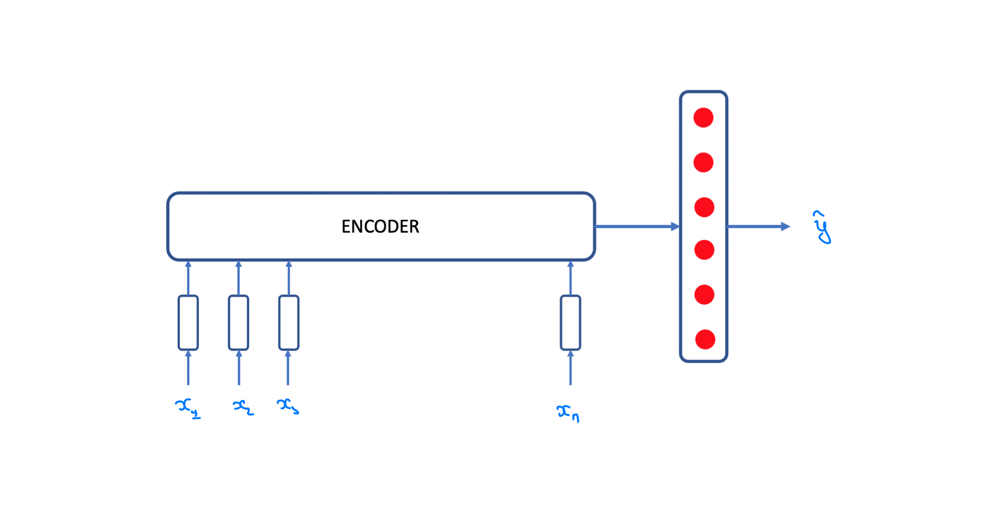
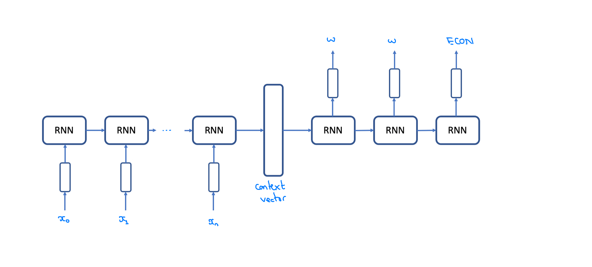

<h1 align="center">Text Endpoint Detection for Conversational Agents</h1>
<h3 align="center">CSE538 NLP: Project Proposal</h3>
<h4 align="center">Team: Anh Nguyen, Omkar Manjrekar, Sriram Vithala</h4>

## 1. Project Idea

When you are chatting with your friend, you seldom type entire body of the message and press send. Instead you will type one message after another and your friend knows to respond when you have specified the required information.

Most conversational agents ("chatbots") in use, require a user to specify all the information in one message like an email and less like a chat. If the user doesn't do that, the agent either detects the intent of the message incorrectly or detects it as "UNKNOWN" intent ("I don't know what that means").

Multiple messages provide extra information which might be needed by the receiver to reply. In contrary to email, in a setting like chat this information can be made available **through-request** **by** the **receiver** or **by realisation** **of** the **sender**. This makes text messaging less formal and more flexible (and is also the reason why people might prefer messaging over email).

The purpose of the project "Text Endpoint Detection for Conversational Agents" is to make these agents learn to reply to the user, when the user has specified required information.

## 2. Problem description

We call this the task of **Text Endpoint Detection**. Given a set of words $W = \{w_1, ... w_n\}$ the task is to find boundaries between which the words combine together to form a complete utterance that the agent can answer. Thus the completeness of utterance depends on the knowledge of the agent.

A variant of this task appears in context of speech processing where the sentence boundaries aren't explicit.

#### 2.1 The problem is interesting because it requires an agent to understand following things about natural language:

1. Is the utterance complete? The sentence might have grammatical mistakes or missing punctuation.
2. Does the text make sense (yet)?
3. Does the text contain **information** **required by the agent to reply**? This may be conditioned on the agent's goal (where goal can be pizza delivery, restaurant booking, or just chitchat, etc.)

#### 2.2 The problem is complex because:

1. The user might skip intent between sentences. The **first** message **and** **third** message provide information about one user intent and **second** message contains another intent.
2. Sometimes it might be okay to reply or wait when the user is still typing.
3. Requires taking into consideration what knowledge is required to reply.

There are usually two approaches to any machine learning problem: Discriminative and Generative. We take a discriminative approach towards solving this problem.

## Problem Formulation

### 1. Classification

Given a set of words, determine whether to wait or reply.

$y = argmax_y Pr(y|w_1,...w_t)$ where $y \epsilon \{wait, reply\} $

### 2. Sequence Labeling

Given a set of words, determine endpoints by labeling the endpoints are reply and other words as wait.

$y_t = argmax_y \prod_1^t Pr(y|w_1,...w_t)$ where $y \epsilon \{wait, reply\} $

The **above two formulations don't encompass skipped intents**. Formulations described in 3 and 4 can deal with this problem.

### 3. Clustering

Learn contextual representation of words which includes positional information. Then either **cluster or regress the boundaries**.

#### 3.1. Clustering with Graph Cut

The clustering idea is inspired from graph cut used for segmentation in computer vision. The analogy is here we are clustering sentences. An additional classification step is required to decide whether to reply to the utterance.

#### 3.2. Graph Neural Networks

Graph Neural Networks have been used for Key Information Extraction (KIE). KIE is used for extracting information in document images for example extracting names of items, their price, shop name, tax, etc. from a receipt. The text for these items may span multiple rows or columns. Thus graph neural networks can be used to cluster words that span the same sentence and contain an intent. 

#### 4. Regression (by voting)

This is regression approach inspired from generalized hough transform and text or object detection techniques.

Each word votes for values between $0.0$ and $1.0$ which is their boundary (when multiplied by number of words). Then we consider the boundaries that contain the most votes. The words that vote for these boundaries form a unique intent.

## Approach

#### Multi-task Learning

As explained in section **2.2**, in order to determine whether to reply or not it is required to take into account the knowledge possessed by the agent. **This motivates us to use multi-task learning to learn intent detection and endpoint detection**.

* Word Embedding: because our work depends on the meaning of user's utterances, using contextual embedding such as ELMo is a good start. In [Le et al], the author used a combination of GloVe, ELMo, and CNN chars embedding. In my opinion, it's a bit unnecessary and it could increase the training/inference time but we definitely consider it as a potential way to improve out baseline.

* SBD as Classification task (predict the token)

  The task is given a set of utterances, called $S = {s_1, s_2, ..., s_n}$. Then an encoder compresses user's messages into a vector $c$ to use in the classifier layers.

The objective task is formalized as:

$$P(y|s_1, s_2, ..., s_n) = P(y|x_1, x_2, ..., x_m)$$

There are many encoder architectures we could try such as RNN-variant, Transformers, BERT, etc.

* SBD as Sequential Label Task

  In the first approach, we need a trigger to know when the users finished their typing (for example from the time between each utterance) or we have to feed the encoder the new data every time user finished a chat, i.e the data will be ${s_1, (s_1, s_2), (s_1, s_2, s_3),...}$. This could be a trouble if the model has high complexity and takes time to generate a context vector. We should not make users wait. Thus the second approach will take a stream data as an input and generate label sequence with the same length as input. In this approach, the labels set consists of three tokens ${W, ESEN, ECON}$ which denote words, end of sentence and end of context.

DailyDialogDailyDialog

Because formulized as a Neural Machine Translation task, then the probability of a word $y_i$ is

$$P(y_i|x_1, x_2, ... x_k)$$		

When ever we see the ECON token, we should pass the context vector or sequence of input words to chatbot. There are several studies on the same problem, where we need to generate output sequence simultaneously with the input sequence. One of the work is from [Cho et al] where the authors proposed a new algorithm for decoder named Simultaneously Greedy Decoding. It's complicated where we need two new hyparameters to control delay and quality. For our problem, we will prioritize quality over delay a bit since it's bad to interupt user.

## Data

The datasets that provide multiple text inputs for the context are needed to explain and understand when the reply is to be sent or wait till one more message is needed for the reply. For example, 

MultiWOZ - DataSet: Each dialogue consists of a goal, multiple user and system utterances as well as a belief state. Even though all dialogues are coherent, some of them were not finished in terms of task description. There are multipple occurences where the scentence is comple but the intent is not complete. We can use this dataset to understand/learn whether the message that user wants to convey has been done or not. This defines/helps in when the chatbot/user2 will reply or wait for the incoming message.

DailyDialog - DataSet: The dialogues in the dataset reflect our daily communication way and cover various topics about our daily life. We also manually label the developed dataset with communication intention and emotion information. 

## Evaluation

- For the first approach, I think we should use Precision Recall and try to minimize the False Positive. It's bad when the chatbot interupts user being talking.

* The second approach, the authors proposed a novel metrics

## References

